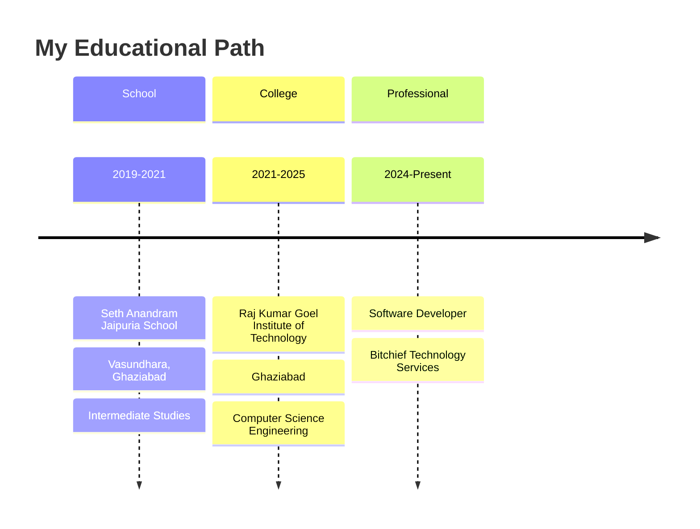

<!-- Title Banner -->
<div align="center">
  
  
  <h1>
    
  </h1>
  
  
  
  
</div>

---


## 🙋‍♂️ About Me

```yaml
name: Aaditya Panda
located_in: Ghaziabad, Uttar Pradesh, India
current_job: Software Developer @ Bitchief Technology Services
education: ["Raj Kumar Goel Institute of Technology"]
interests: ["Software Development", "IoT", "Embedded Systems"]
motto: "Code. Create. Innovate. 🚀"
```

<div align="left">

- 🌐 **From:** Ghaziabad, Uttar Pradesh, India
- 💼 **Currently:** Software Developer at **Bitchief Technology Services Pvt Ltd**
- 📚 **Learning:** Latest trends and technologies in the digital realm
- 💻 **Expertise:** Software Development & Embedded Systems Engineering
- 🎯 **Goal:** Making a positive impact through technology
- ⚡ **Fun fact:** I turn coffee into code! ☕➡️💻

</div>

---

## 🛠️ My Tech Arsenal

<div align="center">

### 🔥 **Languages & Frameworks**

<table>
<tr>
<td align="center" width="96">

<br><strong>C</strong>
</td>
<td align="center" width="96">

<br><strong>C++</strong>
</td>
<td align="center" width="96">

<br><strong>Python</strong>
</td>
<td align="center" width="96">

<br><strong>JavaScript</strong>
</td>
<td align="center" width="96">

<br><strong>Node.js</strong>
</td>
</tr>
<tr>
<td align="center" width="96">

<br><strong>React</strong>
</td>
<td align="center" width="96">

<br><strong>Express</strong>
</td>
<td align="center" width="96">

<br><strong>HTML5</strong>
</td>
<td align="center" width="96">

<br><strong>CSS3</strong>
</td>
<td align="center" width="96">

<br><strong>MySQL</strong>
</td>
</tr>
</table>

### 🔧 **Hardware & IoT**

<table>
<tr>
<td align="center" width="96">

<br><strong>Arduino</strong>
</td>
<td align="center" width="96">

<br><strong>Raspberry Pi</strong>
</td>
<td align="center" width="96">

<br><strong>Nginx</strong>
</td>
</tr>
</table>

</div>

---

## 🎓 Academic Journey

<div align="center">



</div>

- 🏫 **High School:** Seth Anandram Jaipuria School, Vasundhara, Ghaziabad
- 🎓 **College:** Raj Kumar Goel Institute of Technology, Ghaziabad
- 💻 **Focus:** Practical knowledge and hands-on experience in Computer Science
- 🚀 **Current Role:** Software Developer at Bitchief Technology Services

---

## 🎯 Aspirations & Goals

<div align="center">

| 🎯 **Short Term** | 🚀 **Long Term** | 💡 **Always** |
|:---:|:---:|:---:|
| Master Full-Stack Development | Lead innovative tech projects | Keep learning & growing |
| Contribute to Open Source | Build impactful software solutions | Share knowledge with community |
| Enhance IoT expertise | Become a tech entrepreneur | Stay curious about new technologies |

</div>

---

## 🌐 Connect With Me

<div align="center">

### 💬 **Let's Connect and Build Something Amazing Together!**

<p align="center">
  <a href="mailto:aadityapanda23@gmail.com" title="Email">
    
  </a>
  <a href="https://wa.me/9871722747" title="WhatsApp">
    
  </a>
  <a href="https://www.linkedin.com/in/aadityapanda/" title="LinkedIn">
    
  </a>
  <a href="https://www.instagram.com/_aaditya_panda_/">
    
  </a>
  <a href="https://portfolio-git-main-aadityapandas-projects.vercel.app/" title="Portfolio">
    
  </a>
</p>

### 📧 **Quick Contact Icons**

<p align="center">
  <a href="mailto:aadityapanda23@gmail.com" title="Email" target="blank">
    
  </a>
  <a href="https://wa.me/9871722747" title="WhatsApp" target="blank">
    
  </a>
  <a href="https://www.instagram.com/_aaditya_panda_/" target="blank">
    
  </a>
  <a href="https://www.linkedin.com/in/aadityapanda/" title="LinkedIn" target="blank">
    
  </a>
  <a href="https://portfolio-git-main-aadityapandas-projects.vercel.app/" title="Portfolio" target="blank">
    
  </a>
</p>

</div>

---

## 📊 GitHub Analytics

<div align="center">

### 🔥 **My Coding Stats**

 


</div>

<div align="center">

### 🏆 **GitHub Trophies**


</div>

<div align="center">

### 📈 **Contribution Graph**


</div>

---

<div align="center">

### ✍️ **Random Dev Quote**


---

### 🐍 **Watch My Contributions Get Eaten by the Snake!**


---


### 💫 **"Code is like humor. When you have to explain it, it's bad."** - Cory House

**Thanks for stopping by! Let's connect and build something amazing together! 🚀**

<br>

[](https://visitcount.itsvg.in)

</div>
