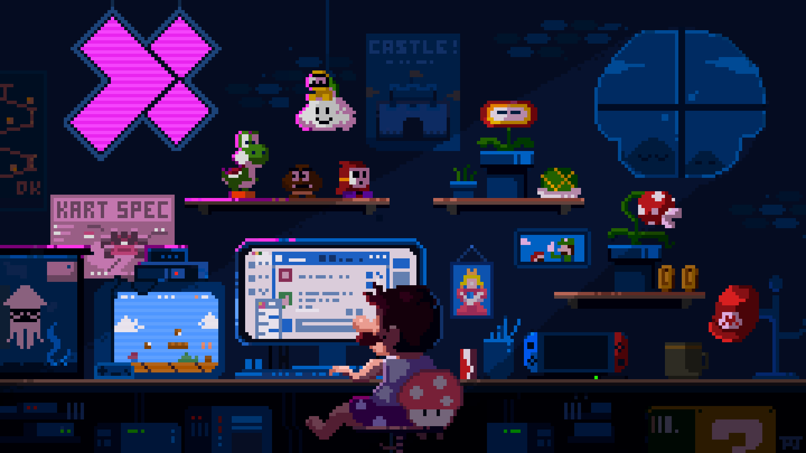
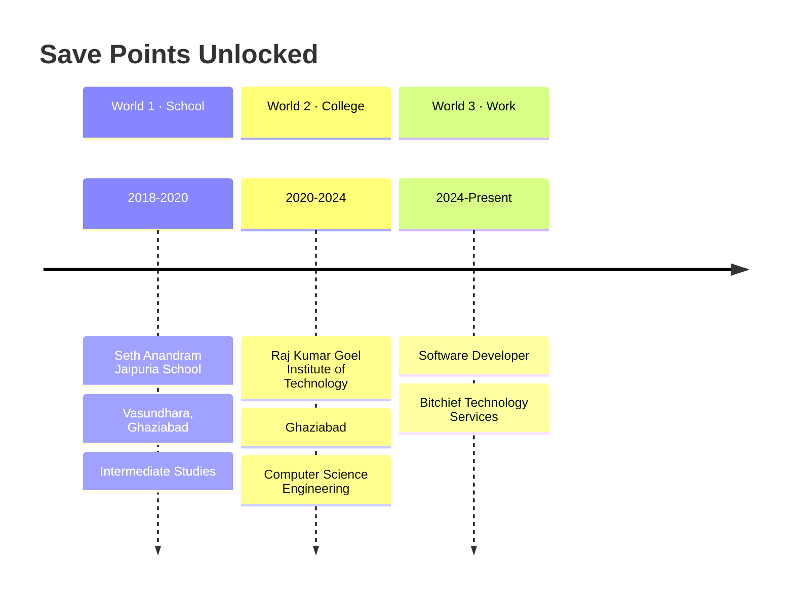

<div align="center">
  

  <h1>
    
  </h1>

  
  
  
</div>

---

## 🕹️ Player Select


```cpp
// player1.ino: runs forever, like any good Arduino sketch
class AadityaPanda : public Player {
  const char* base      = "Ghaziabad, Uttar Pradesh, India";
  const char* job       = "Software Developer @ Bitchief Technology Services";
  const char* training  = "Computer Science Engineering, RKGIT";
  const char* perks[3]  = {"Software Development", "IoT", "Embedded Systems"};
  const char* motto     = "Code. Create. Innovate. 🚀";

public:
  void loop() {
    coffee >> code;            // fun fact: coffee in, code out
    learn(); build(); ship();  // goal: a positive impact through tech
  }
};
```

---

## 🍄 Power-Ups

<div align="center">

**⭐ Code**


**🔌 Circuits & Servers**


</div>

---

## 🗺️ World Map

<div align="center">


```mermaid
timeline
    title Save Points Unlocked
    section World 1 · School
        2018-2020 : Seth Anandram Jaipuria School
                  : Vasundhara, Ghaziabad
                  : Intermediate Studies
    section World 2 · College
        2020-2024 : Raj Kumar Goel Institute of Technology
                  : Ghaziabad
                  : Computer Science Engineering
    section World 3 · Work
        2024-Present : Software Developer
                     : Bitchief Technology Services
```

</div>

---

## 📜 Quest Log

- [x] Clear World 2: graduate in Computer Science Engineering *(2024)*
- [x] Unlock the job: Software Developer *(2024)*
- [ ] Master full-stack development
- [ ] Contribute to open source
- [ ] Level up IoT & embedded expertise
- [ ] Lead innovative tech projects
- [ ] Become a tech entrepreneur 🚀

> ♾️ **Side quests that never end:** keep learning · share knowledge with the community · stay curious

---

## 📊 Stats Screen

<div align="center">


### 🏆 Trophy Shelf


### 🧱 Level Map

<picture>
  <source media="(prefers-color-scheme: dark)" srcset="https://raw.githubusercontent.com/AadityaPanda/github-readme/main/output/contribs-dark.svg">
  
</picture>

### 🐍 Boss Fight: The Snake vs My Commits

<picture>
  <source media="(prefers-color-scheme: dark)" srcset="https://raw.githubusercontent.com/AadityaPanda/AadityaPanda/output/github-contribution-grid-snake-dark.svg">
  
</picture>

</div>

---

## 💬 Multiplayer

<div align="center">

**Want to co-op? Pick a controller:**

<a href="mailto:aadityapanda23@gmail.com" title="Email"></a>
<a href="https://wa.me/9871722747" title="WhatsApp"></a>
<a href="https://www.linkedin.com/in/aadityapanda/" title="LinkedIn"></a>
<a href="https://www.instagram.com/_aaditya_panda_/" title="Instagram"></a>
<a href="https://aadityapanda.vercel.app/" title="Portfolio"></a>

### 🧙 NPC Says…


*"Code is like humor. When you have to explain it, it's bad."* · Cory House

</div>
